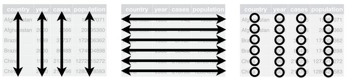
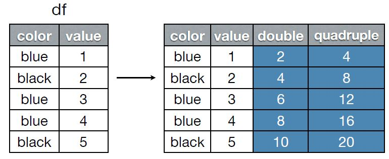

# Tidyr

## Ordenar bases de datos


<center>

 <figure>
  
  <figcaption>Fig1. - http://garrettgman.github.io/tidying/</figcaption>
</figure> 

</center>

## 


* **Multiples variables en una columna**


```{r message=FALSE, echo=FALSE, warning=FALSE}

library(readr)
library(tidyr)
library(dplyr)
library(nycflights13)


population <- read.csv("/home/camila/MEGA/tutorial1/Presentación/DATA/tidy/population.csv", sep=";")
tbl_df(population)

```


##


* **Valores en los nombres de las columnas**

<center>
```{r echo=FALSE, message=FALSE, warning=FALSE}
Religion <- read_csv("/home/camila/MEGA/tutorial1/Presentación/DATA/tidy/pew.csv")
tbl_df(Religion)
```
</center>

##

* **Nombre de las variables en las celdas**

<center>
```{r echo=FALSE, message=FALSE, warning=FALSE}
Clima <- read_tsv("/home/camila/MEGA/tutorial1/Presentación/DATA/tidy/weather.txt", na = ".")
tbl_df(Clima)

```
</center>


## gather()

Pasa de un formato ancho a un formato largo.


```{r}

popul <- population %>% 
                    gather(demo, cases,  m_04:f_65, na.rm = F)

```

<center>
```{r echo=FALSE}
tbl_df(popul)
       
```
</center>

##

<center>

</center>


```{r}
popul <- population %>% 
                    gather(demo, cases,  -iso2, -year, na.rm = F)
```


## separate()

<center>

</center>

```{r}

sep_pol <- popul %>%
                 separate(demo, c("sex", "age"))

```


## spread()

Pasa de un formato largo a uno ancho.

```{r}
popul2 <- sep_pol %>%
              spread(sex,cases)

```


<center>
```{r, echo=FALSE}
tbl_df(popul2)
```
</center>


##

```{r}
tbl_df(Clima)
```


## 

```{r message=FALSE, warning=FALSE}

Cl2 <- Clima %>%
         gather(dias, conteo, `1`:`31`, na.rm = FALSE) %>%
                                          spread(element,conteo)
```

<center>
```{r echo=FALSE}
head(Cl2)
```
</center>


## unite()

Unión entre dos o más variables y dejar solo una


<center>
```{r}

tbl_df(sep_pol)

```
</center>


##

```{r}

Uni_pol <- sep_pol %>%
                   unite(union, year, age, iso2) 

```


<center>
```{r echo=FALSE}
tbl_df(Uni_pol) 
```
</center>


## fill()
Sustituye los valores faltantes por el valor previo a este


```{r echo=FALSE}
data_exa <- data.frame(Month= rep(1:6,3)  ,Year = c(2010,rep(NA,5),2011,rep(NA,5),2012,rep(NA,5)), Value = runif(18,0,10))

```

<center>
```{r echo=FALSE}
data_exa
```
</center>

##


```{r}
fil <- data_exa%>%
          fill(Year)
```


<center>
```{r echo=FALSE}
tbl_df(fil)
```
</center>


# dplyr

## filter()

Retorna valores con ciertos criterios estipulados

<b>*filter(df, color == "blue")*</b>

<center>

</center>

##

```{r}
rel <- Religion %>%
            gather(Ingresos, conteo, -religion)%>%
              filter(conteo > 700 )    

```

<center>
```{r echo=FALSE}
rel
```
</center>


## arrange()

Ordena variables (desc)

```{r}

ord_ing <- rel %>%
               arrange(conteo)

```

<center>
```{r echo=FALSE}
tbl_df(ord_ing)
```
</center>


## mutate()

Crea nuevas variables que son función de las ya existentes.

<center>

</center>


## group_by()

```{r}
ex_g <- rel%>%
            group_by(religion) %>%
                      mutate(porcen = conteo/sum(conteo))
ex_g
```


##

```{r}
tbl_df(Clima)
```


##

```{r}
Cl1 <- Clima %>%
       gather(dias, Tem ,-year,-month,-element, na.rm=TRUE) %>%
        spread(element,Tem)%>%
          group_by(month)%>%
            summarise(pro_tmax = mean(as.numeric(tmax)),pro_tmin  =        
             mean(as.numeric(tmin)))%>%
              mutate(rango = pro_tmax-pro_tmin)%>%
                arrange(desc(rango))

```

<center>
```{r echo=FALSE}
Cl1
```
</center>


## summarise()

Resume varios valores a valores por grupo o a un solo valor por medio de una función

```{r}
#conteo de d?as cuyo rango fue superior a 150 grados
Con_tem <- Cl1 %>% filter(rango>150) %>%
             summarise( conteo = n(), prom = mean(rango))

Con_tem

```

# ¿Cómo unir bases de datos?


## join

<b>_join(x, y, by = NULL)</b>

<center>

</center>


##


```{r}
tbl_df(weather)
```

##

```{r}
tbl_df(flights)
```


## inner_join()


##

```{r}

flights2 <- flights %>%
  group_by(origin, month, day, hour) %>%
  filter(!is.na(dep_delay)) %>%
  summarise(
    delay = mean(dep_delay),
    n = n()
  ) %>%
  filter(n > 10)


flights3 <-flights2 %>%
  inner_join(weather) %>%
  filter(wind_speed < 1000)

```

##


```{r}
tbl_df(flights3)
```


## left_join()


##  semi_join()


##  anti_join()


## Referencias


* https://speakerdeck.com/hadley/pipelines-for-data-analysis-in-r

* http://hadley.nz/


