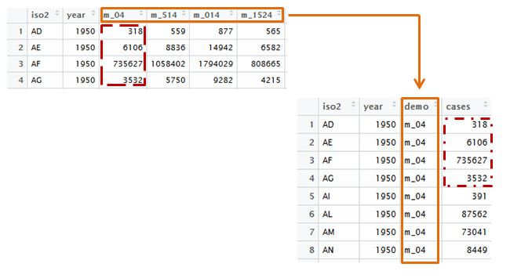
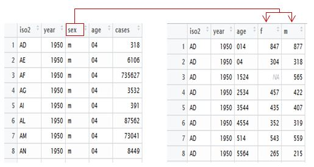
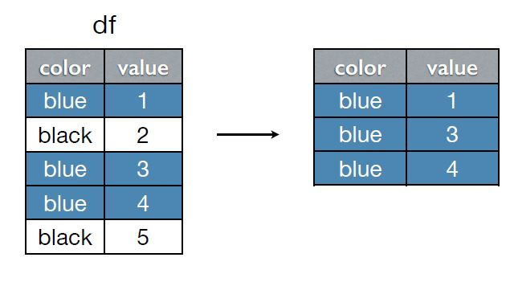
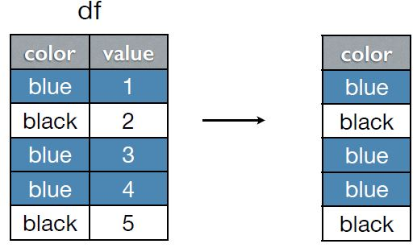
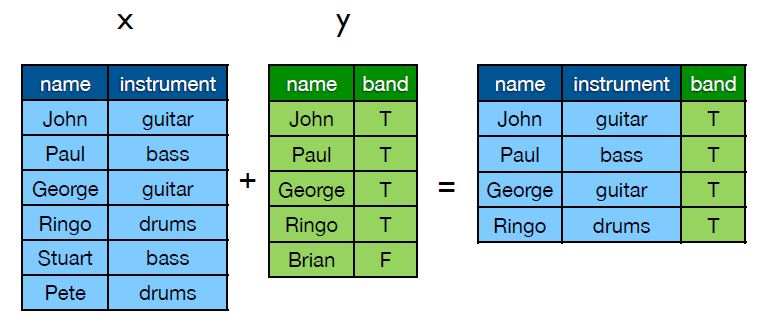
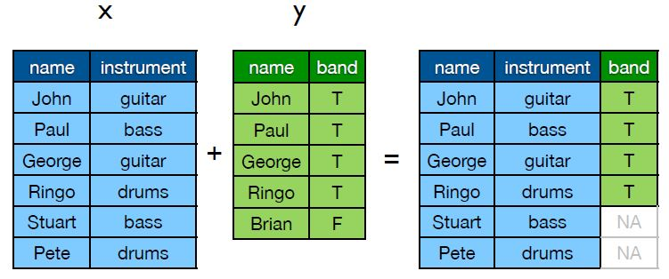
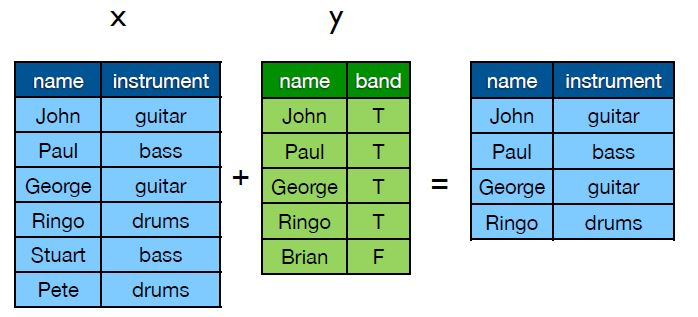
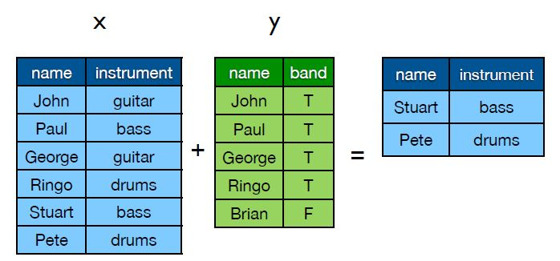

<body style="text-align: justify;">

***

Tidyr y Dplyr son dos paquetes estadísticos creados por _Hadley Wickham_, el primero diseñado específicamente para ordenar datos en R de manera parecida a data frame pero en formato ordenado (tidy), _Wickham_ propone que los datos queden organizados del siguiente modo:

* Cada variable está en una columna
* Cada observación está en una fila

Por otro lado dplyr es una evolución del paquete **plyr** creado para análizar y manipular datos de manera más rápida. 

***


#### Instalación:

Ambos paquetes esta disponible desde el <abbr title="The Comprehensive R Archive Network">CRAN</abbr>, así que puede ser instalado con la función: <u>install.packages("tidyr")</u> y de manera equivalente el paquete dplyr y activados haciendo uso del comando library("tidyr") y library("dplyr").

<font color="red">*Nota*:</font> Muchas de las funciones de tidyr y dplyr tiene como argumento $\cdots$, lo que indica que no se sabe el número de argumentos que tendrá este parámetro en general, es muy importante tener en cuenta que una vez usado el argumento “$\cdots$”, cualquier parámetro que continúe después de él debe ser  nombrado.


#### **Funciones de tidyr:**


* <font color="blue">gather:</font> Pasa de un formato ancho a un formato largo.
* <font color="blue">separate:</font> Separa una columna en varias columnas.
* <font color="blue">fill:</font> Sustituye los valores faltantes por el valor previo a este.
* <font color="blue">unite:</font> Pega varias columnas en una sola.
* <font color="blue">spread:</font> Es lo contrario de _gather_ y  se usa para pasar de formato largo a ancho


#### Base de datos

Se trata de una base formada por la organización mundial de la salud que contiene la estimación desde el año 1990 hasta el 2016 de las muertes causadas por tuberculosis en 213 ciudades; para cargar la base en R depende el formato con el que haya sido guardado el archivo, en <a href="https://rugbcn.wordpress.com/2012/10/08/963/">este enlace</a> puede observar con detalle la manera de hacerlo.

```{r,echo=FALSE,warning=FALSE, message=FALSE}
library(xtable)
library(pander)
library(tidyr)
library(dplyr)
population <- read.csv("~/Documents/tutorial1/DATA/tidy/population.csv", sep=";")

```


<center>
```{r}
tbl_df(population)
```
</center>


Como se puede observar el problema de los datos es que los nombres de las columnas como “m_04”, no tiene un formato ordenado porque “m" representa el género de la persona (masculino) y "04" el rango de edad (muerte por causa de tuberculosis en niños de 0 a 4 años de edad), de la misma manera pasa con las variables "f_".


#### **Operador %>%**

Este operador fue desarrollado por _Stefan Milton_ en el paquete magrittr, realmente no es necesario para que funcione el paquete pero la practicidad de este operador lo hace interesante para el uso de las funciones.

Así, por ejemplo con el uso de la función _separate_ utilizando el operador %>%:

<p align="center">
            Data %>%
            separate(nombre, c("var1","var2"))
</p>

Es equivalente a:

<p align="center">
            separate(Data, nombre, c("var1","var2"))
</p>


#### Función <b>gather()</b>


Los argumentos principales de esta función son los siguientes:

* <font color="blue">data:</font> La base de datos con formato data.frame
* <font color="blue">key:</font> Nombre de la columna que incluirá los nombres o etiquetas de las columnas que pasaran del formato ancho al largo.
* <font color="blue">value:</font> El nombre que asignamos a la columna que incluye los valores de las columnas.
* <font color="blue"> $\cdots$:</font> Es la especificación de las columnas que se quieren pasar a formato largo.
* <font color="blue">na.rm:</font> Si na.rm = T remueve todas las filas donde el valor de la columna sea un dato faltante.


Luego, la estructura básica de la función es:

<p align="center">
Data %>%
gather(key, value, $\cdots$, na.rm)
</p>


Ahora, para obtener la base de datos propuesta ordenada el código correspondiente es:


```{r }
pop_new  <- population %>%
     gather(demo, cases, m_04:f_65, na.rm = F)
```


<center>
```{r echo=FALSE}
head(pop_new)
```
</center>


Como es posible observar ahora quedan menos columnas y más filas, donde cada fila tiene el dato correspondiente a cada columna.

<center>

</center>


#### Función <b>separate()</b>

La finalidad de esta función es separar variables de observaciones o simplemente separar columnas, los argumentos principales de esta función son los siguientes:


* <font color="blue">data:</font> La base de datos con formato data.frame.
* <font color="blue">col:</font> Columna de datos que se quiere separar.
* <font color="blue">into:</font> Nombre de las nuevas variables que se van a crear.


Luego, la estructura básica de la función es:

<p align="center">
Data %>%
separate(col, into)
</p>

Por lo cual el código para separar género de rango de edad en la base de datos tratada es:


```{r}
pop_new2 <- pop_new %>%
            separate(demo, c("sex","age")) 

```


<center>
```{r echo=FALSE}
head(pop_new2)
```

</center>


#### Función <b>fill()</b>

Los argumentos principales de esta función son los siguientes: 

* <font color="blue">data:</font> La base de datos con formato data.frame.
* <font color="blue">$\cdots$:</font> las columnas en las que se quiere encontrar el valor faltante.

Dado esto, la estructura básica de la función es:

<p align="center">
data %>% fill($\cdots$, .direction = c("down", "up") )
</p>

Esta función es útil cuando los valores se repiten y están registrados cada vez que cambian, por ejemplo una serie de tiempo en la cual se toman medidas  semestrales y solo ponen las fechas en las que fueron tomadas las medidas iniciales.

<center>
```{r echo=FALSE}
data_exa <- data.frame(Month= rep(1:6,3)  ,Year = c(2010,rep(NA,5),2011,rep(NA,5),2012,rep(NA,5)), Value = runif(18,0,10))

data_exa
```
</center>


Por lo tanto el código que se emplea para completar esos valores faltantes en la variable _Year_ es:


```{r results='hide'}
data_exa %>% fill(Year)

```

<center>
```{r echo=FALSE}
data_exa %>% fill(Year)

```
</center>


#### Función <b>unite()</b>

El objetivo de _unite_ es  realizar un merge (unión) entre dos o más variables y dejar solo una, los argumentos principales de esta función son los siguientes:


* <font color="blue">data:</font> La base de datos con formato data.frame.
* <font color="blue">col:</font> Nombre de la columna en la que quedara la unión especifica
* <font color="blue">$\cdots$:</font> Nombre de las columnas con las que se realiza el merge.

Luego, la estructura básica de la función es:


<p align="center">
Data %>% unite(col, $\cdots$)
</p>


Por lo tanto si fuese de interés unir la variable género y el año el código a ejecutar sería el siguiente

```{r}

unir <- pop_new2 %>%
         unite(union,year,sex,iso2)

```


<center>
```{r echo=FALSE}
head(unir,15)
```
</center>


#### Función <b>spread()</b> 

Se utiliza para que cada variable diferente que está en una fila tenga su propia columna y cada observación su propia fila, los argumentos principales de esta función son los siguientes:

* <font color="blue">data:</font> La base de datos con formato data.frame
* <font color="blue">key:</font> Nombre de la columna que se quiere cambiar de formato largo a formato ancho.
* <font color="blue">value:</font> El nombre de la variable (columna) que contiene los valores que tomara _key_.

Luego, la estructra básica de la función es:

<p align="center">
Data %>% spread(key, value)
</p>

Como ejemplo, suponga que la variable _sex_ se quiere dividir en tantos niveles tenga esta variable, en este caso solo corresponde a dos columnas (una para el género masculino y la otra para el femenino), el codigo correspondiente es:

<center>
```{r}
pop_new3 <- pop_new2 %>% 
  spread(sex,cases)
head(pop_new3)
```
</center>


La funcionalidad de este comando se puede observar mejor en la siguiente ilustración: 
<center>

</center>

Para finalizar con la explicación de _tidyr_, el siguiente ejemplo combina por medio del operador %>% la función _gather_ y _spread_.

```{r echo=FALSE}
titanic2 <- read.csv("~/Documents/tutorial1/DATA/tidy/titanic2.csv")
```


<center>
```{r}
titanic2
```
</center>


La base contiene las caracteristicas y el destino (_fate_) de los pasajeros del Titanic, el objetivo es pasar de columnas a filas las variables "male" y "famale" (_gather_) y pasar de filas a columnas todos los niveles de la variable "fate" que en este caso solo son dos (_spread_).

```{r}
titanic <- titanic2 %>%
           gather(gender, n, male:female) %>%
           spread(fate, n) 
```


<center>
```{r echo=FALSE}
titanic
```
</center>


***


#### **Funciones de dplyr:**

* <font color="blue">filter:</font> Retorna filas con ciertos criterios estipulados.
* <font color="blue">arrange:</font> Ordenar.
* <font color="blue">select:</font> Selecciona columnas especificadas.
* <font color="blue">mutate:</font> Añadir variables.
* <font color="blue">summarise:</font> Aplicar comandos a variables.
* <font color="blue">.join:</font> Combinar registros de dos o más tablas en una base de datos.


#### Función <b>filter()</b> 

Se utiliza para filtrar registros bajo criterios estipulados, los argumentos principales de esta función son los siguientes:


* <font color="blue">data:</font> Nombre del data frame.
* <font color="blue">$\cdots$:</font> Variable y expresión lógica.


Luego, la estructura básica de la función es:


<p align="center">
Data %>% filter($\cdots$)
</p>

Ahora, puede observar gráficamente lo que realiza la función, suponga que tiene la siguiente base (df) y quiere filtrar los registros que solo tengan color azul, luego de emplear el código **df %>% filter(color == "blue")** obtendrá como resultado una nueva base solo con los datos cuyo registro sea el color azul:

<center>

</center>


Dada la base de titanic, suponga que quiere solo los registros de la variable _"age"_ igual a _"child"_ y género femenino que pertenecían a la segunda y tercer clase, el código correspondiente está dado por:


```{r echo=FALSE, message=FALSE}
library(dplyr)
library(nycflights13)
```


```{r results='hide'}
titanic <- titanic2 %>%
           gather(gender, n, male:female) %>%
           spread(fate, n) 
```


<center>
```{r echo=FALSE}
titanic %>%
       filter(age =="child" & gender=="female" & class %in% c("2nd","3rd"))
```
</center>

#### Función **arrange()**


Ordena las filas de menor a mayor valor de la variable elegida, si desea realizarlo en orden descendente utilice la función <font color="azul">desc</font> o escriba un signo menos en la variable.

El siguiente codigo ordena de mayor a menor la base de datos *Titanic* por número de personas fallecidas (perished).

```{r results='hide'}
titanic %>% 
   arrange(desc(perished))
```


<center>
```{r echo=FALSE}
titanic %>% 
   arrange(desc(perished))
```
</center>

#### Función **select()**

Este comando elige un subconjunto de las variables especificadas por el usuario; de manera ilustrativa suponga que "df" es su base de interés pero solo le interesa tener la variable *"color"*, así que con el código: **Data %>% select(color)**  o de manera equivalente **Data %>% select(-value)** usted obtendría solo una columna de su data frame con la variable color:


<center>

</center>


Suponga que de la base *titanic* solo le interesa la columna el género y la de los sobrevivientes

```{r results='hide'}
titanic %>%
  select(c(gender,survived))
```


<center>
```{r echo=FALSE}
titanic %>%
  select(c(gender,survived))
```
</center>


O que le interesa tener la base con las variables que van de *age* a *perished*

```{r results='hide'}
titanic %>%
  select(age:perished)
```


<center>
```{r echo=FALSE}
titanic %>%
  select(age:perished)
```
</center>


#### Función **mutate()**

Con esta función se crean nuevas variables que son función de las ya existentes, en este ejemplo se crean dos variables la primer corresponde a la proporción de adultos y niños que sobrevivieron en el titanic y la segunda a la proporción de los que fallecieron.


```{r results='hide'}
titanic %>%
  filter(age %in% c("adult","child")) %>%
     mutate(prop_sob = survived/sum(survived), 
            prop_per = perished/sum(perished))

```

<center>
```{r echo=FALSE}
titanic %>%
  filter(age %in% c("adult","child")) %>%
     mutate(prop_sob = survived/sum(survived), 
            prop_per = perished/sum(perished))
```
</center>


En dado caso donde solo se quisiera observar el resultado de las nuevas variables se utiliza la función <font color="blue">transmute</font>:


```{r results='hide'}
titanic %>%
  filter(age %in% c("adult","child")) %>%
     transmute(prop_sob = survived/sum(survived), 
            prop_per = perished/sum(perished))
```


<center>
```{r echo=FALSE}
titanic %>%
  filter(age %in% c("adult","child")) %>%
     transmute(prop_sob = survived/sum(survived), 
            prop_per = perished/sum(perished))
```
</center>

#### Función **summarise()**

Resume varios valores a valores por grupo o a un solo valor por medio de una función, por ejemplo para conocer el total de sobrevivientes del titanic se genera el siguiente código:


```{r}
titanic %>% 
  summarise(sum(survived))

```


El total de sobrevivientes y fallecidos por *age*:

```{r}
titanic %>%
  group_by(age) %>%
    summarise(sum(survived),sum(perished))
```

Promedio, mediana y percentil 75 de las personas que sobrevivieron y las que no en el titanic clasificadas por clases:

```{r}
titanic %>% 
  group_by(class) %>%
     summarise(prom_sob = mean(survived), prom_fall = mean(perished),
               med_sob = median(survived), med_fall = median(perished),
               q75_sob = quantile(survived,.75), q75_fall = quantile(perished,.75))

```


#### Función **inner_join()**:

Selecciona la filas que cumplen la condición de emparejamiento, es decir, de las bases a concatenar solo une las filas que son iguales en las bases, así el merge realizado con el código **inner_join(x,y)** daría como resultado:


<center>

</center>


Para el siguiente ejemplo se utiliza las bases de datos *flights* y *weather* de la librería *nycflights13* la primera corresponde a las características de todos los vuelos que  salieron de Nueva York JFK en el año 2014 y la segunda a datos meteorológicos por hora para LGA, JFK y EWR.

```{r}
head(flights)
```

```{r}
head(weather)
```


el objetivo es realizar un inner_join por *origin*, *month*, *day* y *hour* entre la base flights y weather.


```{r}


flights2 <- flights %>%
  group_by(origin, month, day, hour) %>%
  filter(!is.na(dep_delay)) %>%
  summarise(
    delay = mean(dep_delay),
    n = n()
  ) %>%
  filter(n > 10)
head(flights2)


flights3 <-flights2 %>%
  inner_join(weather)


head(flights3)

```


#### Función **left_join()**: 

Selecciona todos los registros de la primera base (la base izquierda) tengan o no correspondencia con la tabla derecha y las une.


<center>

</center>


```{r}
flights4 <-flights2 %>%
  left_join(weather) %>%
  filter(wind_speed < 1000)

```

<center>
```{r echo=FALSE}
head(flights4)
```
</center>


#### Función **right_join()**:

Hace lo mismo que *left_join* pero une todos los registros de la tabla derecha que tengan o no correspondencia con la de la izquierda. En ambas situacionrd aquellos registros sin correspondencia tendran en su campo correspondiente un valor NULL.


```{r}
flights5 <-flights2 %>%
  right_join(weather) %>%
  filter(wind_speed < 1000)
```


<center>
```{r}
head(flights5)
```
</center>

#### Función **full_join()**:

Corresponde a la unión de totos los elementos de ambas bases, en el caso de no encuentrar semejanzas se completan con NA los campos sin datos. 


```{r}
flights6 <-flights2 %>%
  full_join(weather) %>%
  filter(wind_speed < 1000)

```


<center>
```{r}
head(flights6)
```
</center>


#### Función **semmi_join()**:

Funciona igual que *inner_join*, pero solo deja los registros de la primer base que son comunes con la segunda y no une las variables diferentes, así como se puede observar en la siguiente ilustración si se realizara el código: **semmi_join(x,y)**

<center>



#### Función **anti_join()**:

Incluye unicamente las filas de la primera base (izquierda) que no hacen match con y:

<center>

</center>


<center>
```{r }
anti_join(flights2, weather)
anti_join(weather, flights2)
```
</center>


**Ilustraciones realizadas por <a href="https://speakerdeck.com/hadley">_Hadley Wickham_</a>**

</body>


