## Introducción. ¿Qué es Shiny?  

 - Crear aplicaciones web interactivas.
 - Visualizar y analizar de los datos.
 - No se manipula el código.
 
## Conocimientos básicos. ¿Qué se requiere?  

 - Es preferible, aunque no necesario, tener conocimientos muy básicos de HTML.
 - Conocimientos en R para poder crear aplicaciones cada vez más avanzadas.
 - Ganas de aprender.
 
## De HTML a Shiny

<center>
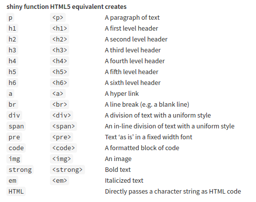
</center>  
<center>
http://shiny.rstudio.com/tutorial/lesson2/
</center>

 - Intuitivo si se tiene una noción muy básica de HTML.
 - Mantiene el mismo código de tags.

## ¿Para qué sirve?  

 - Funciones reactivas.
 - Registro de cambios realizados.
 
<center>
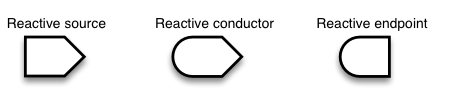
</center>  

<center>
http://rstudio.github.io/shiny/tutorial/#reactivity-overview
</center>  


Estos son los tres diferentes tipos en programación reactiva. 


## Reactive

<center>
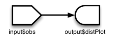
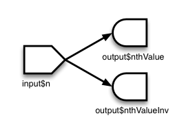
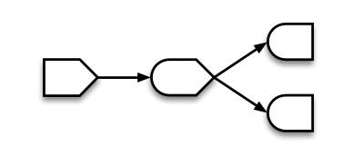
</center> 

<center>
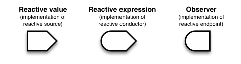
</center> 
<center>
http://rstudio.github.io/shiny/tutorial/#reactivity-overview
</center>  

Leve diferencia entre observadores y expresiones reactivas:

 1. Flujo de eventos.
 2. No retornan valores.


## Resumen y tips


<center>
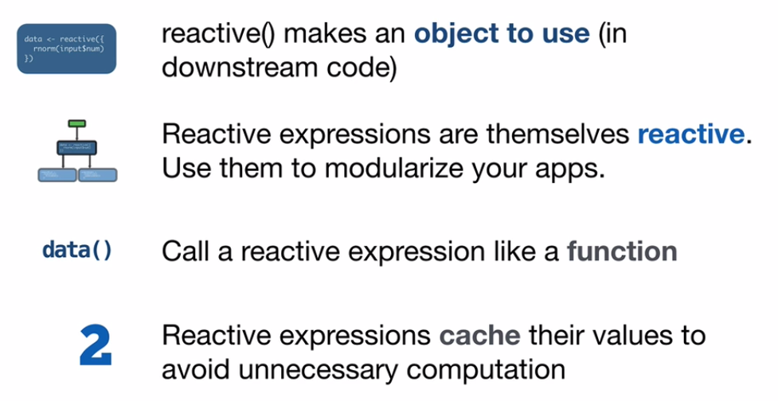
</center> 
<center>
http://shiny.rstudio.com/tutorial/lesson2/
</center> 

## Widgets más comunes

<center>
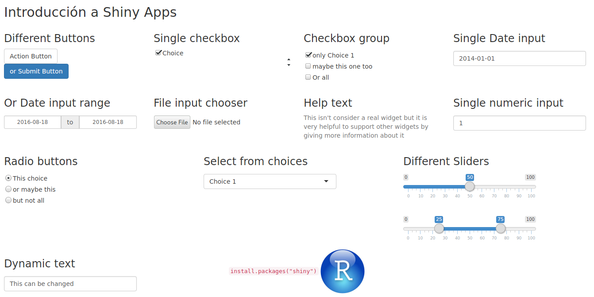
</center> 

## Funciones para llamar los Widgets de la aplicación

<center>
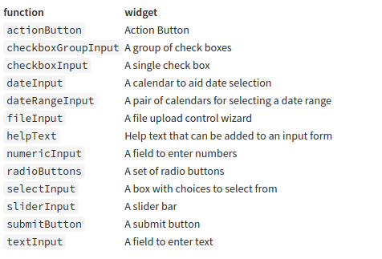
</center> 
<center>
http://shiny.rstudio.com/tutorial/lesson3/
</center> 

Estas funciones se encargan de tomar los datos de la aplicación desde 
la interfaz gráfica **_ui.R_** y mandarlos al servidor para que sean procesados.

## Funciones que generan una salida en la aplicación

<center>
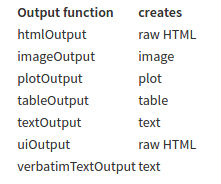
</center> 
<center>
http://shiny.rstudio.com/tutorial/lesson4/
</center> 

Estas funciones de salida se utilizan en la interfaz gráfica de Shiny **_ui.R_**
para mostrar los objetos reactores creados en la aplicación.

## Funciones que renderizan un objeto en la aplicación

<center>
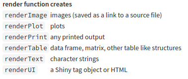
</center> 
<center>
http://shiny.rstudio.com/tutorial/lesson4/
</center> 

Estas funciones de render se utilizan en el servidor de Shiny **_Server.R_**
para decirle a Shiny cómo debe de construir los objetos.

## Desempeño de la Aplicación **_Server.R_**

<center>
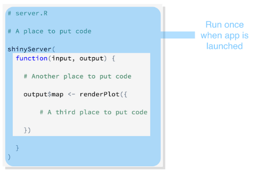
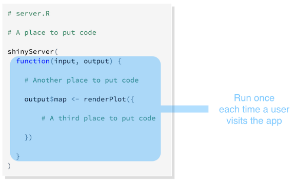
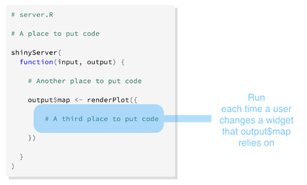
</center> 
<center>
http://shiny.rstudio.com/tutorial/lesson5/
</center> 


## The Shiny App Example **_ui.R_**

```

shinyUI(fluidPage(
  
  titlePanel("Fútbol Shiny App"),
  
  sidebarPanel(
    
    fileInput('datafile', h5(strong('Choose CSV file')),
              accept=c('text/csv', 'text/comma-separated-values,text/plain'),
              multiple=TRUE),
    
    hr(),
  
    sliderInput("slider2", label = h5(strong("Number of observations")), min = 1, 
                max = 500, value = c(1,50)),
    
    hr(),
    
    verbatimTextOutput("text"),
    
    hr(),
    
    radioButtons("column", label = h5(strong("Bar Plot Processed Table")),
                 choices = list("Balance Total Goles como Local" = 1, 
                                "Balance Total Goles como Visitante" = 2), 
                 selected = 1),
    
    submitButton("Change Plot")
    
  ),
  
  mainPanel(
    tabsetPanel(type = "tabs", 
                tabPanel("Unprocessed Table", tableOutput("filetable")),
                tabPanel("Processed Table", tableOutput("processedtable")),
                tabPanel("Plot", plotOutput("plot"))

  ))
))
```

## The Shiny App Example **_server.R_**

```
shinyServer(function(input, output) {
  
  filedata <- reactive({
    infile <- input$datafile
    if (is.null(infile)) {
      return(NULL)
    }

    df <- df_loader(input)
  })
  
  processed_data <- reactive({
    if(is.null(filedata())){
      return(NULL)
    }
    
    df <- process_data(filedata())
    
  })
  
  output$filetable <- renderTable({
    filedata()[input$slider2[1]:input$slider2[2],]
  })
  
  output$processedtable <- renderTable({
    processed_data()
  })
  
  output$plot <- renderPlot({
    if(is.null(processed_data())){
      return(NULL)
    }
    if(input$column==1){
      bar_plot_btgl(processed_data())
    }
    else{
      bar_plot_btgv(processed_data())
    }
  })
  
  output$text <- renderText({
    out <- "Files Chosen: "
    if(is.null(filedata())){
      return(paste(out, "Nothing yet", sep=''))
    }
    tmp <- paste(input$datafile$name, input$text, sep=",")
    tmp <- paste(tmp, collapse = "")
    out <- paste(out, tmp)
    out <- substr(out, 1, nchar(out)-1)
    return(out)
  })

})
```

## The Shiny App Example **_global.R_**

```

library(dplyr)
library(plyr)
library(shiny)

df_loader <- function(input){
  
  list_df <- lapply(1:dim(input$datafile)[1], function(number){
  
    path <- input$datafile[[number, 'datapath']]
    
    df <- read.csv(path, header = TRUE, sep = ",", dec = ".", stringsAsFactors=FALSE)
    
    df <- df [, c("Div","Date","HomeTeam","AwayTeam","FTHG",
                  "FTAG","FTR","HTHG","HTAG","HTR")]
    
    df
  })
  df <- plyr::rbind.fill(list_df)
  df
}

process_data <- function(df){

  teams <- unique(df$HomeTeam)
  
  list_df <- lapply(teams, function(team){
    if(team != 'Reading' && team != ""){
      partidos_ganados <- dim(df %>%
                                filter((HomeTeam == team & FTR == 'H') | 
                                         (AwayTeam == team & FTR == 'A')))[1]
      
      partidos_perdidos <- dim(df %>%
                                 filter((HomeTeam == team & FTR == 'A') |
                                          (AwayTeam == team & df$FTR == 'H')))[1]
      
      partidos_empatados <- dim(df %>%
                                  filter((HomeTeam == team & FTR == 'D') |
                                           (AwayTeam == team & FTR == 'D')))[1]
      
      bal_tot_gol_loc <- sum(df %>%
                               filter(HomeTeam == team) %>%
                               select(FTHG)) -
        sum(df %>%
              filter(HomeTeam == team) %>%
              select(FTAG))
      
      bal_tot_gol_vis <- sum(df %>%
                               filter(HomeTeam == team) %>%
                               select(FTAG)) -
        sum(df %>%
              filter(HomeTeam == team) %>%
              select(FTHG))
      
      df = data.frame(Team=team, PG = partidos_ganados, 
                      PP = partidos_perdidos, PE = partidos_empatados,
                      BTGL = bal_tot_gol_loc, BTGV = bal_tot_gol_vis, 
                      stringsAsFactors=FALSE)
    }
  })
  df_processed <- plyr::rbind.fill(list_df)
  return(df_processed)
}

bar_plot_btgl <- function(df_processed){
  
  var_xbtgl = sort(df_processed$BTGL, decreasing = TRUE)
  xtick_btgl = df_processed[order(df_processed$BTGL, decreasing = TRUE), ]$Team
  
  barplot(var_xbtgl, ylab = 'Diferencia de Goles', width = 1)
  title('Balance de Goles como Local')
  axis(side = 1, at=1:length(xtick_btgl), labels = xtick_btgl)

}

bar_plot_btgv <- function(df_processed){
  
  var_xbtgv = sort(df_processed$BTGV, decreasing = TRUE)
  xtick_btgv = df_processed[order(df_processed$BTGV, decreasing = TRUE), ]$Team
  
  barplot(var_xbtgv, ylab = 'Diferencia de Goles', width = 1)
  title('Balance de Goles como Visitante')
  axis(side = 1, at=1:length(xtick_btgv), labels = xtick_btgv)
  
}
```
