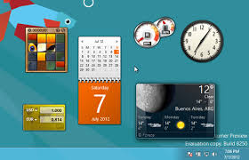
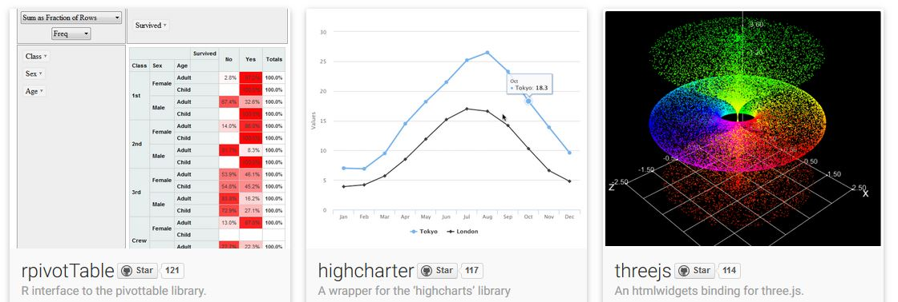
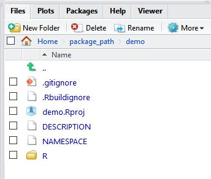
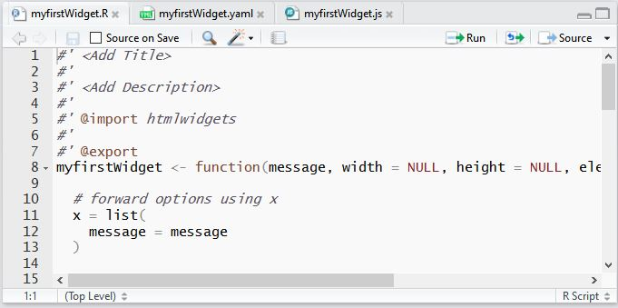
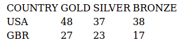

<style type="text/css">

  #faux-h1 {
    font-size: 2em; margin: .67em 0;
  }
  
  #faux-h2 {
    font-size: 1.5em; margin: .75em 0;
  }
  
  #questions {
    text-align: center;
    font-size: 2em;
    padding-top: 2em;
    padding-bottom: 2em;
  }
     
</style>


## ¿Qué es un widget?

<p style="text-align: justify;">
Es una pequeña aplicación o programa que tiene como finalidad dar fácil acceso a funciones frecuentemente usadas y proveer de información visual
</p>

  
<div class="columns-2">
  
- **_Widgets de escritorio:_**


Herramientas descargables interactivas que insertamos en el escritorio 
del pc.

<center>

</center>

<div style="height: 15px"></div>


- **_Web widgets:_**

<center>

</center>

<p style="text-align: justify;">
Funcionalidades o contenidos que pueden ser instalados y ejecutados en una página de manera sencilla.
</p>


</div>


## ¿Qué es Htmlwidgets?{.flexbox .vcenter}

<p style="text-align: justify;">
Es un paquete de R que permite crear de forma fácil enlaces de **R** a librerías **JavaScript**, para realizar herramientas interactivas y no requiere una conexión a Internet o la disponibilidad permanente de un servicio de Internet para funcionar.
</p>





## 


**Dependencias**


 HTML                                CSS                          JavaScript
---------------------------------- -------                      --------------
Define el contenido                 **Especifica el diseño**    **Programa el comportamiento**


<p>
>* **R binding**

>*  Datos de entrada (input) para el widget.
>* Opciones de como debe funcionar el widget.
>* Funciones requeridas para utilizar widget dentro de aplicaciones Shiny.

</p>

<p>
>* **JavaScript binding**
</p>

>* El codigo que permite pasar los datos y las opciones generadas en R y unirlas a la libreria JavaScript

## 

|    Función / Método    |                               Descripción                              |
|:----------------------:|:----------------------------------------------------------------------:|
| create                 | Crea un objeto que tiene un prototipo especificado                     |
| GetObject              | Devuelve una referencia a un objeto de automatización desde un archivo |
| document.activeElement | Devuelvel el elemento seleccionado actualmente en el documento         |
| document.cookie        | Devuleve todos los valores de las cookies en el documento              |
| document.createElement | Crea un elemento (nodo)                                                |
| item                   | Devuelve el elemento actual de la colección                            |


# Un proyecto HTMLWidgets siempre debe estar organizado dentro de un paquete en R

## [Creación de paquetes con RStudio](http://erre-que-erre-paco.blogspot.com.co/2013/03/creacion-de-paquetes-con-rstudio.html)


<p style="text-align: justify;">
- Un panel específico con las instrucciones adecuadas para el desarrollo de paquetes y una vista de los resultados de la compilación y los errores.
</p>
<p style="text-align: justify;">
- Un comando “Build and Reload” que reconstruye el paquete y vuelve a cargarlo en una nueva sesión.
</p>
<p style="text-align: justify;">
- Herramientas para la documentación en R que incluyen la vista previa, la corrección ortográfica y la edición [Roxygen2](https://support.rstudio.com/hc/en-us/articles/200532317-Writing-Package-Documentation)
</p>
<p style="text-align: justify;">
- Integración del paquete [devtools](https://cran.r-project.org/web/packages/devtools/devtools.pdf) para el desarrollo de funciones.
</p>

## 

<div class="columns-2">

```
install.packages("devtools")
install.packages("roxygen2")
library(devtools)
library(roxygen2)

# Creación de paquete:
devtools::create("mypackage")

```


</div>


**_roxygen2_**: hace fácil el contenido de la documentación del paquete

```
#' Titulo
#'
#' @param x    descripción
#' @return     resultado de la función
#' @examples   Ejemplos
#  vignette("roxygen2", package = "roxygen2")
```


## HTMLWIDGETS


```
htmlwidgets::scaffoldWidget("myfirstWidget")
```

<center>

</center>


## Algunas funciones útiles

| Función                             | Descripción                                                                                                                           |
|-------------------------------------|---------------------------------------------------------------------------------------------------------------------------------------|
| createWidget                        | Crea un htmlwidget  basado en YAML  y JavaScript que contiene el paquete                                                              |
| shinyWidgetOutput / shinyRenderWidget | Ayuda a crear una salida y hacer funciones para el uso de HTMLwidgets dentro de las aplicaciones Shiny y documentos interactivos .rmd |
| onRender                            | Complementa el widget de una función de JavaScript pero solo para un objeto específico                                                |


## 


```
<!DOCTYPE html>
<html>
<body>

<p id="demo"></p> 

<table id="table"></table>

<script type="text/javascript" class="init">

var Olympics = [["COUNTRY", "GOLD", "SILVER", "BRONZE"],
["USA", 48, 37, 38],["GBR", 27, 23, 17]];

Olympics.forEach(function(items) {
  var row = document.createElement("tr");
  items.forEach(function(item) {
    var cell = document.createElement("td");
    cell.textContent = item;
    row.appendChild(cell);
  });

```

##

```

table.appendChild(row);
});

</script>

</body>
</html>

```


<center>

</center>


```
for(i = 0; i < x.nomFunc.length; i++){

document.write(x.nomFunc[i] = "<br/>")

}

```


