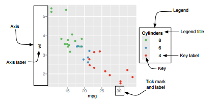

```{r setup, include=FALSE}
knitr::opts_chunk$set(echo = TRUE)
```

## ggplot2 Library

 - ggplot fue creada por Hadley Wickham.
 - Es un esquema general para la visualización de datos.
 - La idea es descomponer un gráfico entre componentes semánticos como escalas, capas, etc.
 
## Componentes en un gráfico
 
Un gráfico está compuesto por:
 
 1. Data: los datos que se quieren visualizar y un conjunto de asignaciones estéticas **_aes_** que indican cómo se quiere asignar las variables a los atributos que se pueden perciben.
 2. Layers: Contruídos por elementos geométricos y transformaciones estadísticas.
  - **_geom_** es la abreviación para construir objetos geométricos. Lo que se ve en el gráfico
  - **_stat_** es la abreviación para construir transformaciones estadísticas. Resumen de la información de diferentes maneras.
 3. Scales **_scale_**: Realiza una asignación del espacio a una asignación de valores estéticos. Determina si debe de llevar color, forma o tamaño.
 4. Coordinate system **_coord_**: Determina cómo la información es asignada a los puntos en el espacio del gráfico. 
 5. A Faceting system **_facet_**: Determina cómo se debe particionar los gráficos en sub gráficos más pequeños y cómo mostrar esos sub gráficos.  
 6. A theme **_theme_**: Controla la parte más fina de la visualización, como el tamaño, el tamaño y tipo de letra y el color de fondo de la gráfica.
 
## Instalación 

Hadley recientemente sacó una librería llamada **_tidyverse_** la cual contiene **_readr, ggplot2, tidyr, purrr, dplyr_** y **_tibble_**

 - ggplot2, para visualización de datos.
 - dplyr, para manipulación de datos.
 - tidyr, para ordenar (poner en orden) los datos.
 - readr, para importar los datos.
 - purrr, para programación funcional.

```
install.packages("devtools")
devtools::install_github("hadley/tidyverse")
library(tidyverse)
```

Si se quiere instalar solo el paquete **_ggplot2_**
```
install.packages("ggplot2")
library(ggplot2)
```

## Componentes Esquema

Componentes de una descripción esquemática de un gráfico

<center>

</center> 

<center>

</center> 
<center>
<cite>ggplot2 Book (Pg 189.)</cite>
</center>


## Ejemplos Faceting

<center>

</center> 
<center>
<cite>ggplot2 Book (Pg 148.)</cite>
</center>

 - plot + facet_grid(. ~ ***variable***): SubPlot en columnas basadas en ***variable*** 
 - plot + facet_grid(***variable*** ~ .): SubPlot en filas basadas en ***variable*** 
 - plot + facet_grid(***variable1*** ~ ***variable2***): SubPlot en filas la ***variable1*** y en columnas la ***variable2*** 
 - plot + facet_wrap(~ ***variable***): SubPlot en filas y columnas la ***variable*** 

<center>
Tomado de: https://www.rstudio.com/wp-content/uploads/2015/03/ggplot2-cheatsheet.pdf
</center>

## Ejemplos Scale

<center>

</center>

## Ejemplos Coord

<center>


</center>

## Ejemplos Theme

<center>


</center>
<center>
<cite>ggplot2 Book (Pg 175.)</cite>
</center>

## Ejemplos Grid

<center>

</center>
<center>
<cite>ggplot2 Book (Pg 178.)</cite>
</center>

## Ejemplo

<center>

</center>
<center>
<cite>ggplot2 Book (Pg 114.)</cite>
</center>


## References 
 - Hadley Wickham, ggplot2 Book, Elegant Graphics for Data Analysis, http://ggplot2.org/book/appendices.pdf
 - ggplot Cheat Sheet, https://www.rstudio.com/wp-content/uploads/2015/03/ggplot2-cheatsheet.pdf
 


